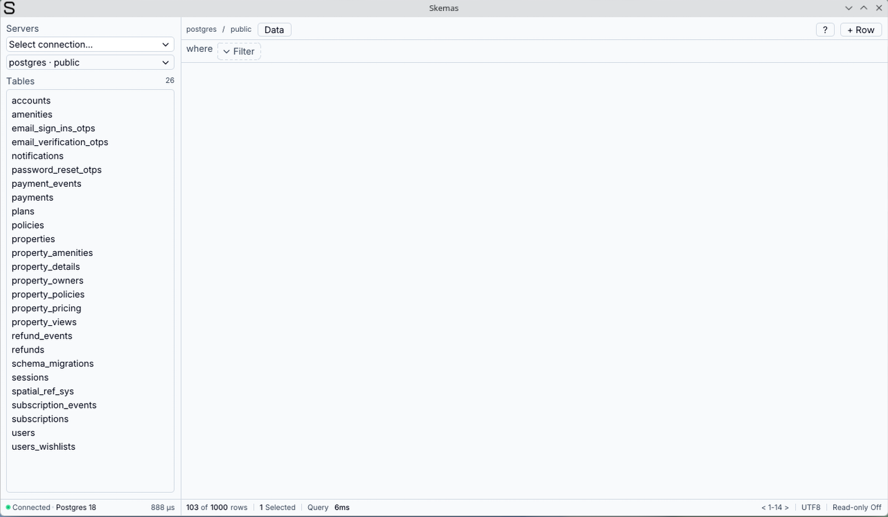

# Skemas

A fast, lightweight database client built with [Odin](https://odin-lang.org) and SDL2/ImGui.



Supports **PostgreSQL** and **SQLite** — focused on making both work perfectly before expanding further.

## Goals

- Memory and CPU efficient
- Sleek UI — do almost everything without writing SQL
- Generates SQL for you when you need it
- Seamless integration with other tooling
- Flexible

## Building

**Dependencies**

- [Odin](https://odin-lang.org) (nightly)
- SDL2 (`sdl2-compat`)
- SDL2_image (`SDL2_image`)
- SQLite (`sqlite-libs`)
- PostgreSQL client (`libpq`)

**Run locally**

```bash
odin run . 
```

**Build and install (Fedora/RPM)**

```bash
./upgrade.sh            # bumps release, builds, installs
./upgrade.sh 0.2.0      # sets a new version, builds, installs
```

The app stores its data at `~/.local/share/skemas/` on Linux and `%APPDATA%\skemas\` on Windows.

## Status

Early development — targeting **v1-beta by August 2026**
